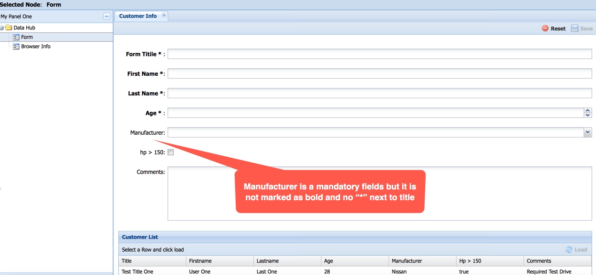

# Bug report for UI Issue

#### Issue number: TPUI-0001
#### Summery: All mandatory field is not marked as bold and * is also missing
#### Priority: Medium
#### Severity: Low
#### Affected version: 2.0.1
#### Component: Form Submission
#### Description
> **Background:**
>  All the mandatory should be clearly identified by the user, so that they can insert data into required field before 
> submitting the form. User might get irrited in case of trying couple of time before submitting the form succeffully.
>
> **Pre-condition**
>  The application TestApplication is downloaded from [here](https://git.toptal.com/screening/md-samsul-kabir/tree/master/uiautomation/TestApplication)
>
> **Step to reproduce**
> * Go to TestApplication/index.html
> * Login using valid credentials. (username/password: test/test)
> * Click on "Form" from left hand side.
> * Then you will see the form with all the empty text field and checkbox.
> * You will see not all the title are marked as bold and not all of them having * next to the title.
>
> **Expected result**
>  All the mandatory field should be marked as bold and having * next to the title.

#### Attachment
